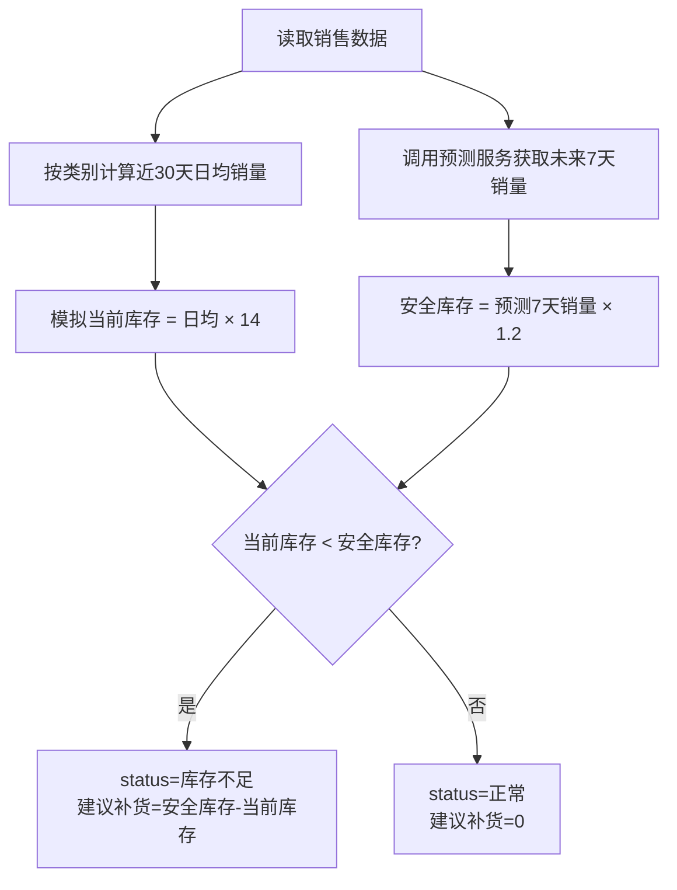

# 库存预警规则

1. 近30天日均销量 = 该类别近30自然日销量之和 / 30
2. 模拟当前库存 = 近30天日均 × 14（约两周销量）
3. 预测7天总需求 = sum(LightGBM/基线 未来7天预测)
4. 安全库存 = 预测7天总需求 × 1.2
5. 当前库存 < 安全库存 → 库存不足，建议补货 = 安全库存 - 当前库存

# 库存预警流程图

```mermaid
flowchart TD
    A[读取销售数据] --> B[按类别计算近30天日均销量]
    B --> C[模拟当前库存 = 日均 × 14]
    A --> D[调用预测服务获取未来7天销量]
    D --> E[安全库存 = 预测7天销量 × 1.2]
    C --> F{当前库存 < 安全库存?}
    E --> F
    F -->|是| G[status=库存不足<br>建议补货=安全库存-当前库存]
    F -->|否| H[status=正常<br>建议补货=0]

```
