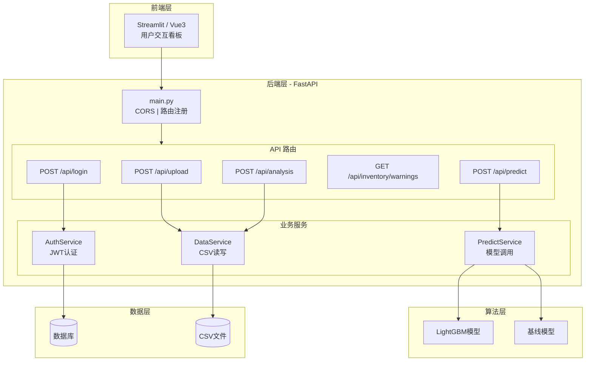

```mermaid
graph TB
    subgraph Frontend["前端层"]
        UI["Streamlit / Vue3<br>用户交互看板"]
    end

    subgraph Backend["后端层 - FastAPI"]
        Main["main.py<br>CORS | 路由注册"]
        
        subgraph Routers["API 路由"]
            Upload["POST /api/upload"]
            Analysis["POST /api/analysis"]
            Predict["POST /api/predict"]
            Warning["GET /api/inventory/warnings"]
            Login["POST /api/login"]
        end
        
        subgraph Services["业务服务"]
            DataSvc["DataService<br>CSV读写"]
            PredictSvc["PredictService<br>模型调用"]
            AuthSvc["AuthService<br>JWT认证"]
        end
    end

    subgraph Algorithm["算法层"]
        LightGBM["LightGBM模型"]
        Baseline["基线模型"]
    end

    subgraph Data["数据层"]
        DB[(数据库)]
        CSV[(CSV文件)]
    end

    UI --> Main
    Main --> Routers
    
    Upload --> DataSvc
    Analysis --> DataSvc
    Predict --> PredictSvc
    Login --> AuthSvc
    
    PredictSvc --> LightGBM
    PredictSvc --> Baseline
    
    DataSvc --> CSV
    AuthSvc --> DB
```