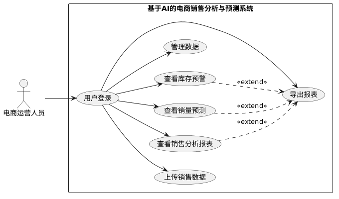
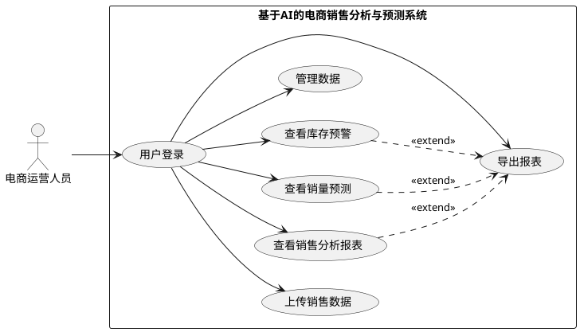

# 用例

> 系统的主要参与者是“电商运营人员”。核心用例覆盖数据管理、销售分析、销量预测、库存预警和系统管理五大功能模块。  
> 用例图生成网站：[PlantUML Web Server](http://www.plantuml.com/plantuml/uml/SyfFKj2rKt3CoKnELR1Io4ZDoSa700001)

## 用例图

  

## 用例阐释

系统只有一个外部参与者：电商运营人员（小A）。小A作为这个系统的唯一使用者，负责日常的数据上传、分析、预测和决策。所有功能都需要小A登录后才能访问。

小A的典型工作流程是：

> 登录 → **上传数据** → **查看销售分析** → 基于分析结果**进行销量预测** → 根据预测结果**查看库存预警** → 导出报表。

系统为运营人员提供以下核心功能：

1. **上传销售数据**：将 CSV 格式的历史订单数据导入系统。
2. **查看销售分析报表**：查看销售额趋势、热销商品排行、地区分布、客户细分占比、折扣影响分析等图表，可扩展多个维度（时间、产品、地区、客户细分）。
3. **查看销量预测**：选择产品类别和预测天数，查看未来销量预测曲线。
4. **查看库存预警**：查看各产品类别的当前库存（模拟）、预测需求量、安全库存阈值和补货建议。
5. **管理数据**：对已上传的数据进行刷新、清洗或删除等维护操作。

其中，**查看销量预测**并不必须依赖于**销售分析**，但建议先分析历史趋势再预测，这样更符合业务逻辑。**管理数据**可以在任意时刻进行，用于纠正或更新基础数据。

工作流程涉及到的两个辅助功能：  
1. 用户登录：是所有其他用例的前置条件，运营人员必须通过登录验证后才能使用系统，体现基本的数据保护安全意识。后续如果需要区分普通用户与管理员，也能为后续扩展留出接口。目前只实现游客登录也是可以的。  
2. 导出报表：运营人员在查看销售分析、销量预测或库存预警结果之后，可以将对应数据和图表导出为 Excel 或 PDF 文件。

## 用例图源代码

