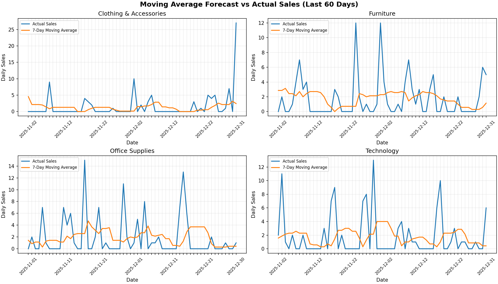

# 移动平均基线预测模型测试报告

## 基本信息

- 测试日期：2026-06-11、2026-06-13、2026-06-14、2026-06-15、2026-06-16、2026-06-17
- 测试分支：`feature/baseline-forecast`、`feature/algorithm-a-predict-api-integration`、`feature/algorithm-a-0614-predict-contract-validation`、`feature/algorithm-a-0615-forecast-evaluation-smoothing`、`feature/algorithm-a-0616-testing-bugfix-evaluation-report`、`feature/algorithm-a-0617-model-comparison-chart`
- 测试对象：算法A移动平均基线预测模型、简单指数平滑备选策略、预测误差评估、预测链路 Bug 修复和答辩模型对比图
- 相关模块：
  - `algorithm/baseline_model.py`
  - `algorithm/evaluation.py`
  - `algorithm/forecast_visualization.py`
  - `backend/services/predict_service.py`
  - `algorithm/inventory_warning.py`
  - `docs/testing/images/moving_average_vs_actual_0617.png`
  - `tests/test_algorithm.py`

## 本地测试环境

- Python：`3.13.12`
- Python 解释器：`D:\Conda\python.exe`
- pytest：`9.0.3`
- pytest 安装方式：`python -m pip install pytest`
- pytest 安装位置：`D:\Conda\Lib\site-packages`

## 测试范围

本次测试重点覆盖算法A今日交付内容：

- 预测天数是否与输入参数一致
- 预测日期是否按天连续递增
- 预测销量是否保持非负
- 是否能按商品类别筛选历史销量
- 是否兼容原始订单列名：`Order_Date`、`Product_Category`、`Quantity`
- 是否正确保留 0 销量历史记录
- 是否将历史区间内缺失日期按 0 销量补齐后参与移动平均
- 是否能直接读取真实原始数据 `data/raw/global_ecommerce_sales.csv` 进行预测
- LightGBM 不存在时，后端预测服务是否能回退到移动平均基线模型
- LightGBM 预测抛错或返回异常结构时，后端预测服务是否能回退到移动平均基线模型
- 未上传数据时，后端预测服务是否能默认读取真实原始 CSV，而不是返回全 0 空预测
- `/api/predict` 是否能在测试鉴权替换后返回后端响应结构
- `/api/predict` 是否能在默认 `model_type="lightgbm"`、显式 `baseline` 和显式 `lightgbm` 三种请求下保持响应结构稳定
- 预测接口是否支持 7、14、30 天预测长度
- `PredictService` 直接调用遇到 `days=0`、负数、非整数、非数字或空值时是否稳定回落到 7 天默认预测
- 未知类别是否不会导致预测服务崩溃，并保持后端兼容结构
- 简单指数平滑策略是否保持日期连续、销量非负、长度正确
- `alpha` 边界值或异常值是否不会导致预测崩溃
- 真实 CSV 上是否能输出移动平均与指数平滑的一步预测 MAE 对比表
- 真实 CSV 上是否能生成最近 60 天实际销量 vs 7 日移动平均一步预测对比图
- 库存预警引擎是否能通过 `PredictService` 调用算法A预测结果
- 本地未安装 LightGBM 依赖时，测试收集是否不会被算法B专项测试阻断
- 在无历史数据时，预测接口是否仍返回后端兼容结构：`{"dates": [...], "sales": [...]}`

## 执行命令与结果

### 1. pytest 安装确认

命令：

```powershell
python -m pip show pytest
```

结果：

```text
Name: pytest
Version: 9.0.3
Location: D:\Conda\Lib\site-packages
```

结论：本地环境已安装 pytest。

### 2. 语法编译检查

命令：

```powershell
python -m compileall -q algorithm backend tests
```

结果：命令退出码为 0，无编译错误输出。

结论：算法、后端服务和测试目录内的 Python 文件语法检查通过。

### 3. pytest 测试收集

命令：

```powershell
python -m pytest tests --collect-only -q
```

结果：

```text
26 tests collected
```

结论：pytest 能正常发现算法、预测接口、评估、库存预警联调、6/16 Bug 修复和 6/17 图表生成相关测试用例，共收集 26 项。

### 4. pytest 详细执行

命令：

```powershell
python -m pytest tests/test_algorithm.py -vv
```

结果：

```text
25 passed, 1 skipped, 1 warning, 14 subtests passed in 5.04s
```

结论：算法A单元测试和预测链路测试全部通过；1 项 LightGBM 专项测试因本地未安装 `lightgbm` 依赖被跳过，不影响算法A回退链路验证。

### 5. tests 目录级 pytest 执行

命令：

```powershell
python -m pytest tests -q
```

结果：

```text
.......................s                                     [100%]
25 passed, 1 skipped, 1 warning, 14 subtests passed in 5.16s
```

结论：当前 tests 目录下可执行的 pytest 测试全部通过；1 项 LightGBM 专项测试因可选依赖缺失跳过；警告为 FastAPI TestClient 依赖链中的 Starlette/httpx 弃用提示，不影响预测接口验证。

### 6. unittest 兼容验证

命令：

```powershell
python -m unittest discover -s tests -p "test_*.py" -v
```

结果：

```text
Ran 26 tests

OK (skipped=1)
```

结论：测试文件仍兼容 Python 标准库 unittest 运行方式，本次运行耗时约 3.32s。

### 7. 最小导入与预测调用

命令：

```powershell
python -c "from algorithm.baseline_model import BaselinePredictor; print(BaselinePredictor().predict('Technology', 7))"
```

结果：

```text
{'dates': ['2026-06-12', '2026-06-13', '2026-06-14', '2026-06-15', '2026-06-16', '2026-06-17', '2026-06-18'], 'sales': [0.0, 0.0, 0.0, 0.0, 0.0, 0.0, 0.0]}
```

结论：模型可被直接导入；无历史数据时仍能返回后端兼容的预测结果结构。

### 8. 真实原始数据预测验证

命令：

```powershell
python -c "from algorithm.baseline_model import BaselinePredictor; print(BaselinePredictor('data/raw/global_ecommerce_sales.csv').predict('Technology', 7))"
```

结果：

```text
{'dates': ['2026-01-01', '2026-01-02', '2026-01-03', '2026-01-04', '2026-01-05', '2026-01-06', '2026-01-07'], 'sales': [1.14, 1.14, 1.14, 1.14, 1.14, 1.14, 1.14]}
```

结论：移动平均模型可直接读取真实原始 CSV，按 `Technology` 类别生成未来 7 天预测；预测日期从真实数据最后日期 `2025-12-31` 的下一天 `2026-01-01` 开始，销量输出为非负浮点数。

### 9. 后端回退验证

验证内容：

- 当 `model_type="lightgbm"` 但 LightGBM 模块不存在时，`PredictService` 会回退到 `BaselinePredictor`。
- 返回结果仍包含 `dates` 和 `sales`，长度与请求天数一致。
- 预测销量保持非负。

结论：后端预测服务在复杂模型不可用时仍能稳定返回结果，符合算法A作为兜底模型的职责。

### 10. 6/13 预测服务默认真实数据源验证

命令：

```powershell
python -c "from backend.services.predict_service import PredictService; print(PredictService().predict('Technology', 7, 'baseline'))"
```

结果：

```text
{'dates': ['2026-01-01', '2026-01-02', '2026-01-03', '2026-01-04', '2026-01-05', '2026-01-06', '2026-01-07'], 'sales': [1.14, 1.14, 1.14, 1.14, 1.14, 1.14, 1.14]}
```

结论：后端预测服务在未上传数据时会默认读取仓库内真实原始 CSV，不再返回全 0 空预测；预测日期从真实数据最后日期 `2025-12-31` 的下一天开始。

### 11. 6/13 `/api/predict` 轻量联调验证

验证内容：

- 使用 FastAPI `TestClient` 调用 `/api/predict`。
- 在测试中替换鉴权依赖，避免登录流程干扰预测接口验证。
- 请求 `{"product_id": "Technology", "days": 7, "model_type": "baseline"}`。
- 响应包含 `product_id`、`predicted_dates`、`predicted_sales` 和 `confidence_interval`。
- `predicted_dates` 从 `2026-01-01` 开始，`predicted_sales` 为非负且不全为 0。

结论：6/13 算法A“供后端调用”的接口联调路径已经通过最小自动化测试。

### 12. 6/14 预测接口契约稳固验证

验证内容：

- `PredictService` 在 `model_type="baseline"` 时继续读取默认真实 CSV。
- `PredictService` 在 `model_type="lightgbm"` 且 LightGBM 不可导入、预测抛错或返回异常结构时，稳定回退到 `BaselinePredictor`。
- `/api/predict` 在省略 `model_type` 时使用后端默认值，并返回 200。
- `/api/predict` 在显式 `model_type="baseline"` 和 `model_type="lightgbm"` 时都返回 `product_id`、`predicted_dates`、`predicted_sales` 和 `confidence_interval`。
- 7、14、30 天预测长度均与请求参数一致。
- 未知类别不会导致接口崩溃，仍返回 `dates` 和 `sales`。

手工验证命令：

```powershell
python -c "from backend.services.predict_service import PredictService; print(PredictService().predict('Technology', 7, 'baseline')); print(PredictService().predict('Technology', 7, 'lightgbm'))"
```

结果：

```text
{'dates': ['2026-01-01', '2026-01-02', '2026-01-03', '2026-01-04', '2026-01-05', '2026-01-06', '2026-01-07'], 'sales': [1.14, 1.14, 1.14, 1.14, 1.14, 1.14, 1.14]}
{'dates': ['2026-01-01', '2026-01-02', '2026-01-03', '2026-01-04', '2026-01-05', '2026-01-06', '2026-01-07'], 'sales': [1.14, 1.14, 1.14, 1.14, 1.14, 1.14, 1.14]}
```

结论：6/14 算法A已完成与算法B LightGBM 合入后的预测接口契约稳固；默认模型路径、显式基线路径和显式 LightGBM 路径均能保持后端响应结构稳定。

### 13. 6/15 预测误差评估与指数平滑备选验证

验证内容：

- `BaselinePredictor` 默认仍使用 `moving_average`，不改变后端 `/api/predict` 公共契约。
- 显式传入 `strategy="exponential_smoothing"` 时，仍返回 `{"dates": [...], "sales": [...]}`。
- `alpha` 为边界值或异常值时不会导致预测崩溃。
- `algorithm.evaluation` 可基于真实 CSV 输出各品类移动平均与简单指数平滑的一步预测 MAE。
- 算法B `compute_inventory_warnings` 可通过 `PredictService` 调用算法A预测结果，返回非负库存、预测需求和建议补货量。

评估命令：

```powershell
python -m algorithm.evaluation
```

结果：

```text
| Category | Observations | Moving Average MAE | Exponential Smoothing MAE | Best Strategy |
|---|---:|---:|---:|---|
| Clothing & Accessories | 1088 | 2.0970 | 2.0977 | moving_average |
| Furniture | 1091 | 2.2392 | 2.2421 | moving_average |
| Office Supplies | 1092 | 2.1876 | 2.1583 | exponential_smoothing |
| Technology | 1094 | 2.4630 | 2.4485 | exponential_smoothing |
```

最小手工验证命令：

```powershell
python -c "from algorithm.baseline_model import BaselinePredictor; print(BaselinePredictor('data/raw/global_ecommerce_sales.csv', strategy='exponential_smoothing').predict('Technology', 7))"
```

结果：

```text
{'dates': ['2026-01-01', '2026-01-02', '2026-01-03', '2026-01-04', '2026-01-05', '2026-01-06', '2026-01-07'], 'sales': [1.68, 1.68, 1.68, 1.68, 1.68, 1.68, 1.68]}
```

结论：6/15 算法A已具备移动平均与简单指数平滑的基础对比能力。真实数据上指数平滑在 `Office Supplies` 和 `Technology` 上略优，移动平均在另外两个品类上略优，因此当前保持移动平均为默认策略，指数平滑作为内部备选和答辩评估材料更稳妥。

### 14. 6/16 测试与 Bug 修复验证

验证内容：

- 从最新远端 `develop` 新建 `feature/algorithm-a-0616-testing-bugfix-evaluation-report`，确认 PR #21 已合入后的算法A能力可继续运行。
- `PredictService` 在直接服务调用中统一规范化 `days`，当传入 `0`、负数、非整数、非数字字符串或空值时，回落到 7 天默认预测，避免 LightGBM 校验或空预测路径抛错。
- 本地未安装 `lightgbm` 时，算法B LightGBM 专项测试会跳过，算法A预测、回退、接口和库存预警联调测试仍能正常收集和执行。
- `/api/predict` 公共契约保持不变，请求字段仍为 `product_id`、`days`、`model_type`，响应字段仍为 `product_id`、`predicted_dates`、`predicted_sales`、`confidence_interval`。

模型评估结果：

```text
| Category | Observations | Moving Average MAE | Exponential Smoothing MAE | Best Strategy |
|---|---:|---:|---:|---|
| Clothing & Accessories | 1088 | 2.0970 | 2.0977 | moving_average |
| Furniture | 1091 | 2.2392 | 2.2421 | moving_average |
| Office Supplies | 1092 | 2.1876 | 2.1583 | exponential_smoothing |
| Technology | 1094 | 2.4630 | 2.4485 | exponential_smoothing |
```

手工验证结果：

```text
PredictService().predict("Technology", 7, "baseline")
=> dates 从 2026-01-01 至 2026-01-07，sales 为 [1.14, ...]

PredictService().predict("Technology", 7, "lightgbm")
=> 本地 LightGBM 依赖缺失时稳定回退，dates 从 2026-01-01 至 2026-01-07，sales 为 [1.14, ...]

PredictService().predict("Technology", "bad", "baseline")
=> 稳定回落到 7 天预测，dates 从 2026-01-01 至 2026-01-07，sales 为 [1.14, ...]
```

结论：6/16 算法A完成测试日关键收口。预测服务对异常 `days` 输入更稳健；缺少可选 LightGBM 依赖时，测试收集不再中断；移动平均仍作为默认策略，指数平滑继续作为内部备选和模型评估材料。

### 15. 6/17 答辩模型对比图验证

验证内容：

- 从最新远端 `develop` 新建 `feature/algorithm-a-0617-model-comparison-chart`，确认 PR #23 已合入后的算法A文档材料继续推进。
- 新增 `algorithm.forecast_visualization`，基于真实 CSV 构建最近 60 天实际销量与 7 日移动平均一步预测对比数据。
- 生成 4 个品类的答辩图，默认输出到 `docs/testing/images/moving_average_vs_actual_0617.png`。
- 图表标题、坐标轴和图例使用英文，避免本地中文字体配置差异影响展示效果。
- `/api/predict` 公共契约保持不变，本轮只新增答辩图表材料和可复现生成脚本。

图表生成命令：

```powershell
python -m algorithm.forecast_visualization
```

结果：

```text
Generated forecast comparison chart: F:\学习资料\大二下资料\软件工程\软件工程期末实践\实验仓库\ai-sales-forecast-system\docs\testing\images\moving_average_vs_actual_0617.png
```

图表文件：



结论：6/17 算法A已完成答辩用“移动平均 vs 实际销量”模型对比图。图中 4 个品类均包含 `Actual Sales` 与 `7-Day Moving Average` 两条曲线，可用于说明移动平均模型能捕捉短期平均趋势，但面对订单尖峰时会更平滑；因此当前继续保持移动平均作为稳定默认策略，指数平滑作为内部备选和评估材料。

## 当前结论

算法A移动平均基线预测模型在当前本地环境下通过语法编译、pytest 收集、pytest 执行、unittest 兼容运行、最小导入调用、真实 CSV 预测、后端回退验证、默认真实数据源验证、`/api/predict` 轻量联调验证、简单指数平滑备选策略验证、真实 CSV 误差评估、库存预警链路最小联调验证、6/16 异常输入 Bug 修复验证和 6/17 答辩模型对比图生成验证。当前测试能证明模型基础预测行为、筛选逻辑、日期连续性、缺失日期补 0、非负输出、原始订单格式兼容性、真实数据输入、LightGBM 异常回退、后端接口调用、预警链路预测调用、直接服务调用异常参数处理和模型对比图可复现生成均符合本阶段交付要求。

## 注意事项

- 当前测试已覆盖算法模块核心行为、后端预测服务轻量回退、LightGBM 异常回退、`/api/predict` 最小 HTTP 联调、预测误差评估和库存预警预测调用，尚未覆盖前端 Streamlit 页面到后端接口的完整人工联调流程。
- 本地 `tests/ffmpeg.zip` 与 `tests/ffmpeg_tmp/` 已加入 `.gitignore`，不会进入后续提交。
- 后续如数据负责人提供 `daily_sales_for_forecast.csv`，建议继续补充基于每日聚合表的集成测试。
